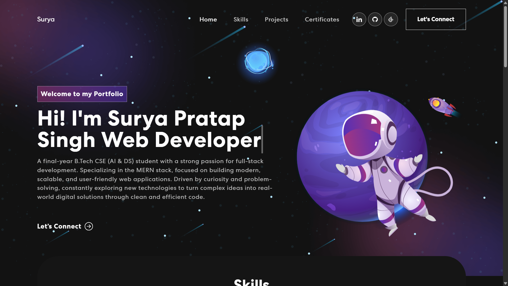
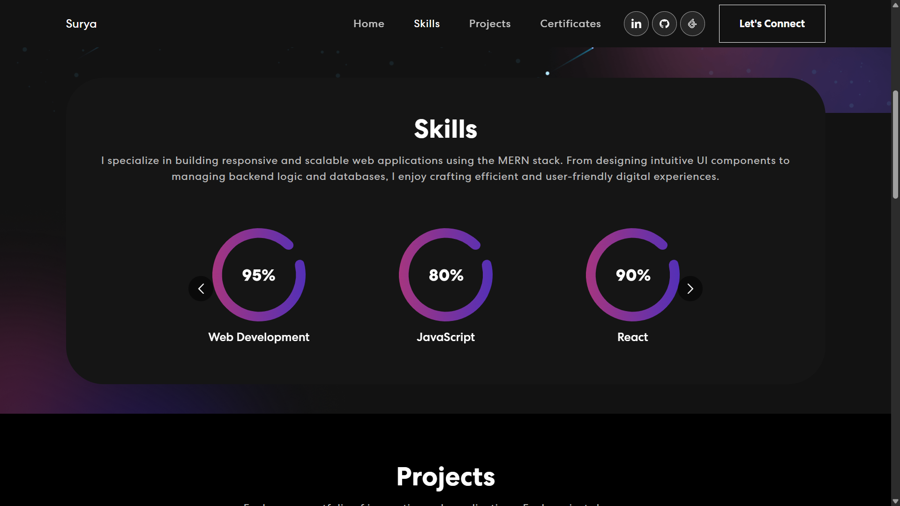
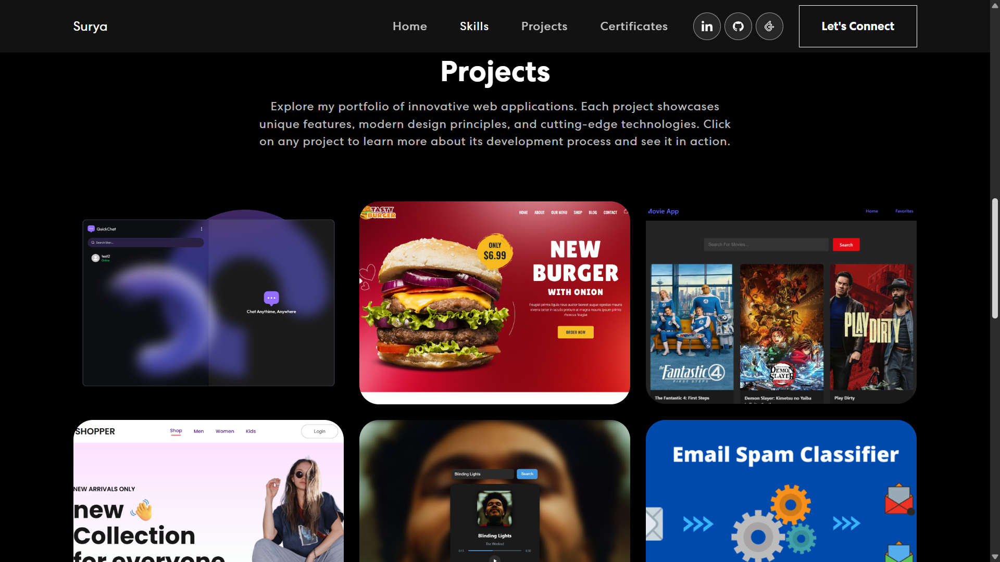
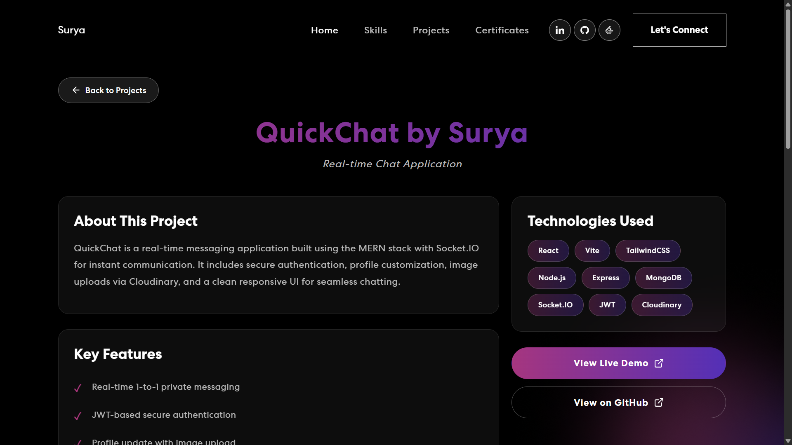
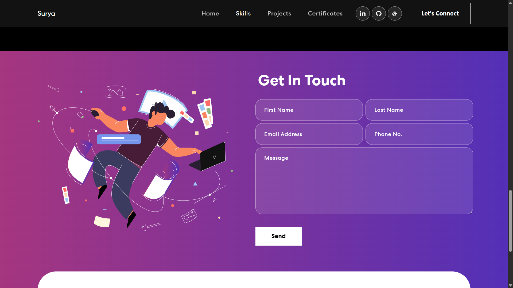
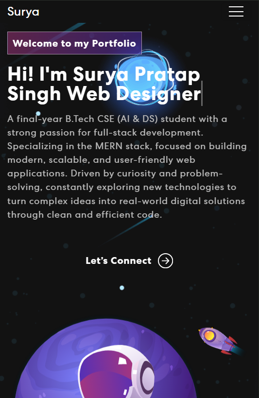
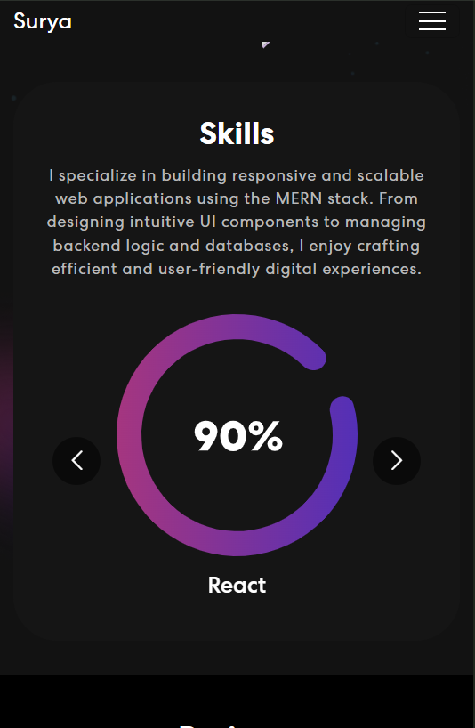
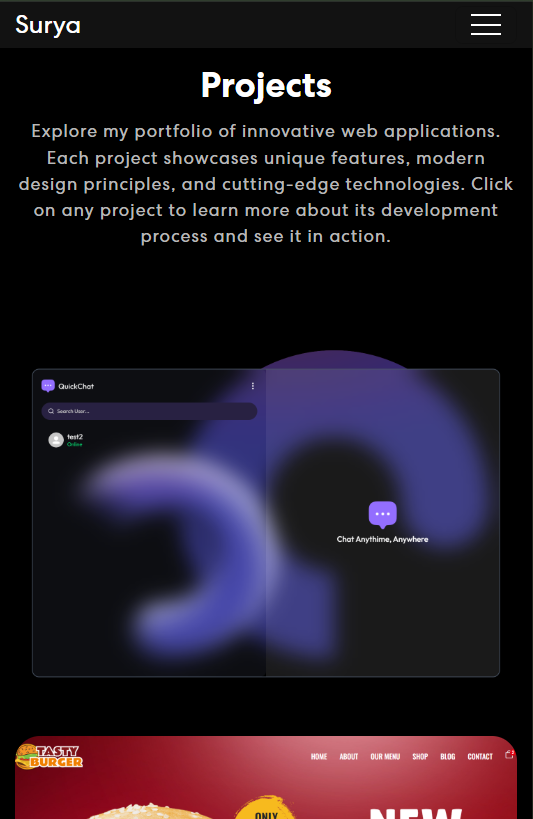
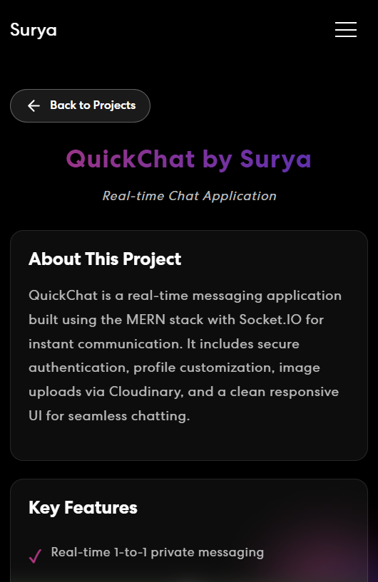
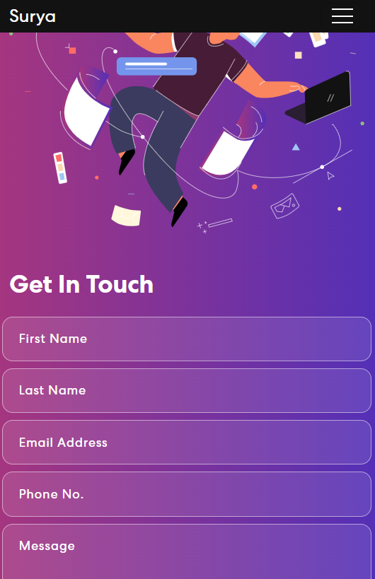

<div id="top"></div>

<div align="center">

# 🌐 PERSONAL PORTFOLIO – BY SURYA
*A Modern, Responsive Developer Portfolio Showcasing My Skills & Projects*


**Tech Stack Used**


</div>

---

## 🖼️ Preview

### 🖥️ Desktop View

| Home | Skills | Projects |
|:--:|:--:|:--:|
|  |  |  |

| Project Detail | Contact |
|:--:|:--:|
|  |  |

---

### 📱 Mobile View

| Home | Skills | Projects |
|:--:|:--:|:--:|
|  |  |  |

| Project Detail | Contact |
|:--:|:--:|
|  |  |

---

## 📑 Table of Contents

- [Overview](#-overview)
- [Demo](#-demo)
- [Features](#-features)
- [Tech Stack](#-tech-stack)
- [Project Structure](#-project-structure)
- [Getting Started](#-getting-started)
- [Environment Variables](#-environment-variables)
- [Usage](#-usage)
- [Future Enhancements](#-future-enhancements)
- [Contact](#-contact)

---

## 🧐 Overview

This **Personal Portfolio Website** showcases my journey as a Full-Stack Web Developer.  
It highlights my skills, projects, and experience with a visually appealing UI and smooth animations.  
Users can explore my projects in detail and contact me directly through an integrated form powered by **EmailJS**.

---

## 🔗 Demo

> Live Preview: https://surya-pratap-singh-portfolio.vercel.app

---

## ✨ Features

✅ Fully responsive (Mobile, Tablet & Desktop)  
✅ Smooth animations with Animate.css & React On Screen  
✅ Interactive projects section with project detail pages  
✅ Contact form with EmailJS integration  
✅ Lazy loading for images (performance optimized)  
✅ Well-structured & reusable component-based architecture  

---

## ⚙️ Tech Stack

### **Frontend:**
- React
- React Bootstrap
- Animate.css
- React-on-Screen
- EmailJS
- Custom CSS

### **Deployment:**
- Vercel (Frontend)
- render (Backend)

---

## 📂 Project Structure

```bash
Portfolio/
├── client/
│   ├── public/
│   ├── src/
│   │   ├── assets/                  # Images & static assets
│   │   ├── components/              # Reusable UI components
│   │   ├── pages/                   # Page-level components
│   │   ├── App.js
│   │   └── index.js
│   └── README.md
└── server/
    └── server.js

```

---

## 🚀 Getting Started

### ✅ Prerequisites

- Node.js & npm installed

---

### 👇 Installation

```bash
# Clone the repository
git clone https://github.com/Surya821/Portfolio

# Navigate to the project
cd Portfolio
```

### 🔧 Setup Client

``` bash
npm install
npm run dev
```

### 🖥️ Setup Server

``` bash
cd server
npm install
npm run server
```

---

## 🔐 Environment Variables

Create a .env file in the server folder:
```bash
RESEND_API_KEY = Your resend api key
FROM_EMAIL = write sender email
RECIPIENT_EMAIL = write recipient email
```

## ▶️ Usage

1. **Visit the live site**
2. **Browse through skills & projects**
3. **Click any project to view detailed info**
4. **Contact me using the form**

---

## 📬 Contact

**Created by — Surya Pratap Singh**  
📩 **Contact Me:**  
[LinkedIn](https://www.linkedin.com/in/surya-pratap-singh1/) • [Gmail](mailto:surya30082005@gmail.com)

If you like this project, consider giving it a ⭐ on GitHub!

<p align="right">(<a href="#top">⬆️ Back to Top</a>)</p>


